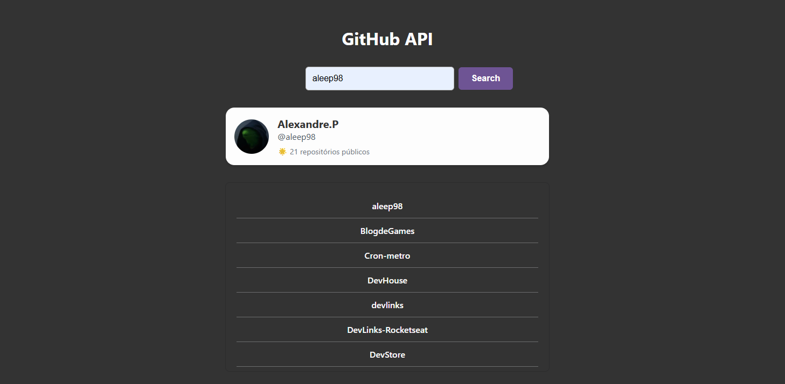

# GitHub Repository Lister

Um projeto web simples para buscar e exibir o perfil e os repositórios públicos de um usuário do GitHub.

## 🚀 Sobre o Projeto

Esta é uma aplicação front-end construída com HTML, CSS e JavaScript puro. Ela consome a API do GitHub para buscar dados de usuários e exibi-los de forma organizada. Ao digitar um nome de usuário, a aplicação mostra um card com informações do perfil e uma lista de seus repositórios públicos.

## ✨ Funcionalidades

- **Busca de Perfil**: Exibe um card com avatar, nome, bio e um link para o perfil do usuário no GitHub.
- **Listagem de Repositórios**: Mostra uma lista com todos os repositórios públicos do usuário.
- **Links Diretos**: Tanto o perfil quanto cada repositório na lista possuem links diretos para o GitHub.
- **Interface Limpa**: Design simples e focado na usabilidade.
- **Feedback Visual**: Exibe uma mensagem de "Carregando..." durante a busca na API.
- **Tratamento de Erros**: Informa ao usuário caso o perfil não seja encontrado ou ocorra um erro na comunicação com a API.

## 💻 Tecnologias Utilizadas

-   **HTML5**
-   **CSS3**
-   **JavaScript (ES6+)**
    -   `async/await` para lidar com operações assíncronas.
    -   `Promise.all` para otimizar múltiplas chamadas de API.
    -   `fetch` para fazer requisições à API do GitHub.

## 🔗 API

Este projeto utiliza a API REST do GitHub para buscar os dados. Especificamente, os seguintes endpoints são consumidos:

-   `https://api.github.com/users/{username}` - Para obter dados do perfil do usuário.
-   `https://api.github.com/users/{username}/repos` - Para obter a lista de repositórios.